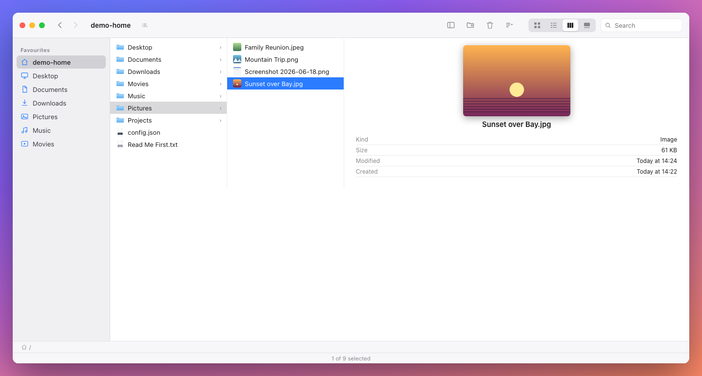

# WebFinder

A browser-based macOS Finder, served over localhost, operating on your **real
filesystem**. Same look and feel as Finder, with icon / list / column views and
the usual file operations. Zero npm dependencies - it runs on Node's built-ins.



*Column view with the live preview pane. Icon, List and Gallery views are a click away.*

## Quickstart

You only need [Node.js](https://nodejs.org/) 18 or newer (`node -v` to check).
Copy and paste:

```bash
git clone https://github.com/markhammond-covecta/webfinder.git
cd webfinder
node server.js
```

Then open **http://localhost:4567** in your browser. That's it - there are no
packages to install (WebFinder runs on Node's built-ins alone) and no build
step. `npm start` works too.

To confine WebFinder to your home folder instead of the whole disk:

```bash
WEBFINDER_ROOT="$HOME" node server.js
```

## Real Finder sidebar (optional)

By default the sidebar shows sensible favourites (Home, Desktop, Documents,
Downloads, Pictures, Music, Movies). To make it mirror your *actual* Finder
favourites, compile the tiny native helper (needs the Xcode Command Line Tools,
`xcode-select --install`):

```bash
./build.sh
```

WebFinder runs fine without this - it just falls back to the default
favourites.

### Run at login (optional)

To have WebFinder start automatically on login (and restart if it crashes),
install it as a per-user macOS LaunchAgent:

```bash
./install-login-item.sh
```

Uninstall with `./uninstall-login-item.sh`.

Options (environment variables):

| Variable          | Default            | Meaning                                              |
|-------------------|--------------------|------------------------------------------------------|
| `PORT`            | `4567`             | Port to listen on (binds to 127.0.0.1).              |
| `WEBFINDER_ROOT`  | `/` (whole disk)   | The directory WebFinder is rooted at. Set to `$HOME` to confine it to your home folder. |

Everything is confined to the root directory; the server rejects any path that
tries to escape it. By default the root is `/`, so **all mounted drives** and
every Finder-sidebar shortcut are reachable.

## All drives & Finder sidebar sync

- **All drives** - rooted at `/`, so `/Applications`, other users, and external
  volumes under `/Volumes` are all browsable. Mounted volumes appear under a
  **Locations** section in the sidebar.
- **Real Finder sidebar** - on first load WebFinder reads your actual Finder
  Favourites (via the optional native helper) and mirrors them in the sidebar,
  display names and all. This uses a system service, so it needs **no** Full
  Disk Access. If the helper isn't built, it falls back to sensible defaults
  (Home, Desktop, Documents, Downloads, Pictures, Applications, ...).

## What it does

- **Views** - Icon, List (sortable columns), Column (Miller) with a live preview
  pane, and Gallery (large preview + thumbnail filmstrip) - switched from the
  toolbar.
- **Toolbar** - sidebar toggle, New Folder, Move to Trash, a Sort-by dropdown,
  the four view switches, an enclosing-folders dropdown next to the title, and
  search.
- **Quick Look** - press Space to preview the selected item (images, PDFs,
  video, audio, text/code; info card for anything else). Arrow keys move between
  items; Space/Esc closes.
- **Navigate** - double-click folders, sidebar Favourites, breadcrumb path bar,
  the title's enclosing-folders menu, Back / Forward, and ⌘↑ to go up.
- **Keyboard navigation** - arrow keys move the selection (grid-aware in Icon
  view; left/right between columns and into/out of folders in Column view);
  type-ahead jumps to the item whose name you start typing; Home/End select the
  first/last item.
- **Open files** - double-click opens a file in its default macOS app
  (via `open`).
- **New Folder** - toolbar button or ⇧⌘N, drops you straight into renaming.
- **Rename** - press Return (or Rename in the context menu) for inline editing.
- **Move / Copy within** - drag selected items onto any folder (in the view, the
  sidebar, or the path bar). Hold ⌥ while dropping to copy instead of move.
- **Drag in** - drag files or folders from Finder/desktop into the window to
  copy them in (folders upload recursively). Dropping on a folder targets it;
  dropping on empty space targets the current folder.
- **Drag out** - drag a file onto the desktop/another app to copy it out. (A
  browser can only ever *copy* on drag-out - it cannot delete the source as part
  of an OS drag, so this is never a move.)
- **Duplicate** - ⌘D or the context menu.
- **Copy / Paste** - ⌘C then ⌘V into another folder.
- **Move to Trash** - toolbar button, ⌘⌫, or the context menu. Items go to your
  real `~/.Trash` (recoverable), exactly like Finder - nothing is hard-deleted.
- **Reveal in Finder** - jump to the item in the real Finder.
- **Search** - filters the current folder as you type.
- **Selection** - click, ⌘-click to toggle, ⇧-click for a range, marquee
  drag-select, ⌘A select all, arrow-key navigation.
- **Hidden files** - ⇧⌘. toggles dotfiles.

### Keyboard shortcuts

| Shortcut        | Action                  |
|-----------------|-------------------------|
| Space           | Quick Look preview      |
| Return          | Rename selected item    |
| ⌘O / ⌘↓         | Open selected           |
| ⌘↑              | Go to enclosing folder  |
| ⌘[ / ⌘]         | Back / Forward          |
| ⇧⌘N             | New Folder              |
| ⌘D              | Duplicate               |
| ⌘C / ⌘V         | Copy / Paste            |
| ⌘⌫              | Move to Trash           |
| ⌘A              | Select All              |
| ⇧⌘.             | Show/hide hidden files  |
| Arrows          | Move selection / between columns |
| Type a name     | Jump to matching item   |
| Home / End      | First / last item       |
| Esc             | Cancel / clear          |

## How it works

- `server.js` - a zero-dependency Node HTTP server. Serves the static UI and a
  small JSON API (`/api/list`, `/api/mkdir`, `/api/rename`, `/api/move`,
  `/api/copy`, `/api/duplicate`, `/api/trash`, `/api/open`, `/api/reveal`) plus
  `/api/file` for streaming file contents (image thumbnails, previews). Every
  path is resolved and checked to stay within the root.
- `public/` - the front-end: `index.html`, `styles.css` (Finder-style chrome
  with light/dark support), `icons.js` (SVG file-type glyphs), and `app.js`
  (all view rendering and interaction logic, vanilla JS).
- `helper/webfinder-helper.swift` - a tiny native helper (compiled by
  `build.sh`) that reads the real Finder sidebar Favourites via the
  `LSSharedFileList` system service. Optional.

## Safety notes

WebFinder operates on real files. It binds only to `127.0.0.1`, confines all
operations to the configured root, and routes deletes to the Trash rather than
removing them outright. Moves and copies are genuine filesystem operations, so
treat it like Finder itself.

Because the default root is the whole disk (`/`), any process on your machine
that can reach `127.0.0.1:4567` can browse and modify files through it. If that
concerns you, run with `WEBFINDER_ROOT=$HOME` (or a narrower path) to confine
it. Deletes still go to `~/.Trash`, so nothing is ever hard-deleted.

## License

Released under the [MIT License](LICENSE).
